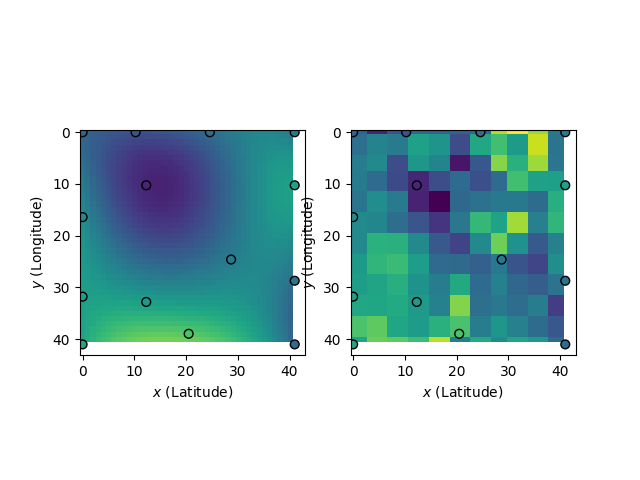
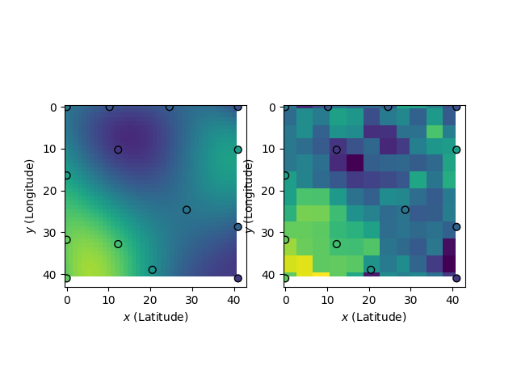

# Above-Ground Carbon Density Estimation

### Setup
1. Using a non-cambridge account and signup for earth engine: https://signup.earthengine.google.com/
2. Create a Google Earth Engine enabled Google Cloud Project
3. Install the Earth Engine library `pip install earthengine-api`
4. Authenticate yourself. Either the code itself will have `ee.Authenticate()` which will open a browser window to authenticate yourself. Or you can use the command line to authenticate yourself, using the gcloud CLI. See https://developers.google.com/earth-engine/guides/python_install-conda#authenticate

### Running the code
Install the dependencies using `pip install -r requirements.txt`.

Try out the existing function by running `python main.py`. This will run the function on default, small subset of data and save a visualization of the estimation vs the ground truth data.

Tinker with the parameters in `main.py`, or you can modify the bayesian optimization procedure in `bayes_opt.py`.

Running the basic examples will look like:
**NDVI**

**EVI**


### Known Issues
Our current usage of GPy ends up throwing several warnings. When running NDVI, we get
```
 .../python3.8/site-packages/GPy/kern/src/rbf.py:52: RuntimeWarning:overflow encountered in square
 .../python3.8/site-packages/paramz/transformations.py:111: RuntimeWarning:overflow encountered in expm1
```
When running EVI, we get
```
 .../python3.8/site-packages/GPy/kern/src/stationary.py:168: RuntimeWarning:overflow encountered in divide
 .../python3.8/site-packages/GPy/kern/src/rbf.py:52: RuntimeWarning:overflow encountered in square
 .../python3.8/site-packages/GPy/kern/src/rbf.py:76: RuntimeWarning:invalid value encountered in multiply
 .../python3.8/site-packages/paramz/transformations.py:111: RuntimeWarning:overflow encountered in expm1
```